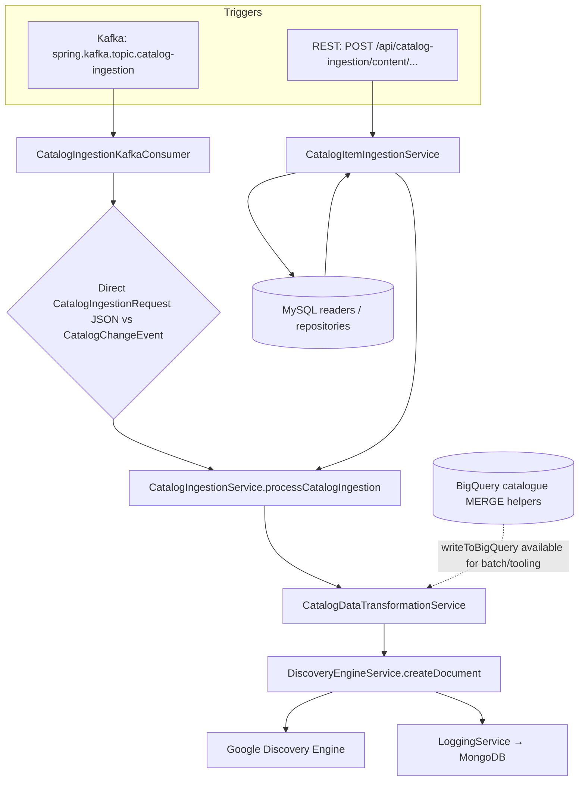

# Binge media search — catalog ingestion & Google Discovery Engine

| Field | Value |
|--------|--------|
| **Audience** | Engineering, search platform, CMS pipeline owners |
| **Service** | **`binge-media-search-ops`** (`tv.videoready.binge_media_search_ops`) |
| **Upstream README** | [`binge-media-search-ops/README.md`](../binge-media-search-ops/README.md) |

This document describes how **catalog content** reaches **Google Cloud Discovery Engine** (search documents), how **Kafka** drives incremental updates, and which **HTTP** endpoints operators use to **verify** or **re-ingest** a single item. It is aligned with the current Java sources in this repo.

---

## 0. Security — admin keys

Operational curls use header **`x-admin-key`**. Treat values as **secrets**:

- **Do not** commit real keys into git, Markdown tickets, or screenshots.
- Obtain UAT / prod keys from your **secrets manager** or **platform team** (the examples you may have seen are **environment-specific** and must stay out of the repo).

Replace **`<X_ADMIN_KEY>`** in all curl snippets below.

---

## 1. What this system does

**`binge-media-search-ops`** ingests **Binge media catalog** rows (movies, series, web shorts, brands, etc.), **transforms** them into the JSON shape Discovery Engine expects, and **upserts** documents in **Google Cloud Discovery Engine**. Optional / parallel use of **BigQuery** (catalogue dataset, `MERGE` upsert helper) exists in `BigQueryService` for warehouse-style writes; the **incremental** path used by Kafka and the **single-item REST** pipeline in code primarily drives **transform → Discovery Engine** plus **MongoDB** operational logging (see §4).

**Search in the app** ultimately reads from Discovery Engine (and related Google search configuration); keeping the **document ID** and **payload** aligned with CMS is what makes “search works”.

---

## 2. Architecture (as implemented)



| Step | Component | Role |
|------|-----------|------|
| 1 | **`CatalogIngestionKafkaConsumer`** | Listens to `${spring.kafka.topic.catalog-ingestion}` (default **`content-updates`**). Parses either a flat `CatalogIngestionRequest` JSON (sync job) or a CMS **`CatalogChangeEvent`**; filters some **SERIES** providers; async processing with manual Kafka ack. |
| 2 | **`CatalogItemIngestionService`** | REST path: loads row from **MySQL** via `BrandRepository` / `MovieRepository` / `WebShortsRepository` / `SeriesRepository`, builds `CatalogIngestionRequest`, calls ingestion service. |
| 3 | **`CatalogIngestionService`** | Validates edge cases (e.g. **Hotstar WEB_SHORTS** subtype), transforms payload, calls Discovery Engine. |
| 4 | **`CatalogDataTransformationService`** | Maps domain fields → Discovery Engine document JSON. |
| 5 | **`DiscoveryEngineService`** | **Blind upsert**: `updateDocument`; on **`NotFoundException`** → `createNewDocument`. Logs outcome via **`LoggingService`**. |
| 6 | **`LoggingService` / Mongo** | Entity `MediaSearchContentUpdate` → collection **`mediaSearchContentUpdates`** (operation, status, payload, timings — see entity in repo). |
| 7 | **`BigQueryService`** | Implements **`MERGE`**-based upsert into configured catalogue table (`bigquery.table.id`, e.g. `catalogue_updates`). **Incremental ingestion service code path inspected here does not call `writeToBigQuery`**; keep BigQuery in mind for **batch / analytics / future wiring** and for `importDocumentsFromBigQuery`-style jobs in `DiscoveryEngineService`. |

---

## 3. Configuration (reference only)

Real values live in **per-environment** `application.properties` / vault. Names match code `@Value` bindings:

| Property | Typical meaning |
|----------|------------------|
| `spring.kafka.topic.catalog-ingestion` | Kafka topic (e.g. `content-updates`) |
| `spring.kafka.consumer.catalog-ingestion.group-id` | Consumer group |
| `bigquery.project.id` / `bigquery.dataset.id` / `bigquery.table.id` | Catalogue BigQuery target |
| `datastore.id` / `location` / `collection.id` | Discovery Engine datastore |
| `spring.data.mongodb.uri` | Mongo for ingestion logs |
| `spring.datasource.*` | MySQL for REST single-item reads |

Do **not** copy production secrets into git; use your deployment’s secret store.

---

## 4. REST API — single item (verify vs ingest)

Controller base path: **`/api/catalog-ingestion`** — see `CatalogIngestionController`.

```20:44:binge-media-search-ops/src/main/java/tv/videoready/binge_media_search_ops/controller/CatalogIngestionController.java
@RestController
@RequestMapping("/api/catalog-ingestion")
public class CatalogIngestionController {
    // ...
    @PostMapping("/content/{contentType}/{id}")
    public ResponseEntity<Map<String, Object>> processCatalogItem(
            @PathVariable String contentType,
            @PathVariable String id) {
```

**`contentType`** (path): `brand`, `movies`, `web_shorts`, `series`, `live_channel` (or aliases normalised in service — see `CatalogItemIngestionService` / controller Javadoc).  
**`id`**: numeric CMS / catalogue id.

> **REST fetch coverage:** `CatalogItemIngestionService` loads **MySQL** rows for **BRAND**, **MOVIES**, **WEB_SHORTS**, and **SERIES** only. Other types may need **Kafka** ingestion or a different endpoint — confirm before relying on POST for `live_channel`.

### 4.1 Check if content is present in Discovery (GET)

Uses **`getDocumentFromDiscoveryEngine`**; returns **404** JSON if the document does not exist.

**UAT (internal TAPI)** — replace `<MOVIE_ID>` and header:

```bash
curl --location --globoff \
  'https://uat-tapi.internal.videoready.tv/binge-media-search-ops/api/catalog-ingestion/content/MOVIES/<MOVIE_ID>' \
  --header 'Accept: application/json' \
  --header 'x-admin-key: <X_ADMIN_KEY>'
```

### 4.2 Ingest / refresh one item (POST)

Loads from MySQL, transforms, upserts Discovery Engine:

```bash
curl --location --globoff --request POST \
  'https://uat-tapi.internal.videoready.tv/binge-media-search-ops/api/catalog-ingestion/content/MOVIES/<MOVIE_ID>' \
  --header 'Accept: application/json' \
  --header 'x-admin-key: <X_ADMIN_KEY>'
```

**Success:** HTTP 200 with `"success": true`. **Failure:** 400 with `"success": false` if the row is missing or processing throws.

### 4.3 Document ID convention (GET vs stored id)

For **movies**, the Discovery document id is typically **`M-<numericId>`** (built in `CatalogItemIngestionService.buildDocumentId`). If debugging in Google Console, search using that composite id.

---

## 5. Catalog purge job (POST)

**Not** the same as “ingest all”; this endpoint triggers **`SportsWebShortsPurgeService.purgeOldSportsWebShorts`**:

```20:25:binge-media-search-ops/src/main/java/tv/videoready/binge_media_search_ops/controller/CatalogPurgeController.java
    @PostMapping("/job")
    public void triggerCatalogSyncJob(@RequestParam(defaultValue = "false") Boolean flag) {
      logger.info("[Purge] :: job started");
      sportsWebShortsPurgeService.purgeOldSportsWebShorts(flag);
```

**Production-style host (example):**

```bash
curl --location --request POST \
  'https://tapi.internal.videoready.tv/binge-media-search-ops/api/catalog-purge/job?flag=false' \
  --header 'x-admin-key: <X_ADMIN_KEY>'
```

Adjust **`flag`** only if your runbook specifies it. Coordinate with **search/SRE** before running in prod.

---

## 6. Kafka incremental flow

1. Producer publishes to **`spring.kafka.topic.catalog-ingestion`**.
2. Consumer **`CatalogIngestionKafkaConsumer`**:
   - If message parses as **`CatalogIngestionRequest`** (no `domainNameEnum`), treated as **sync / flat** payload.
   - Else parsed as **`CatalogChangeEvent`** and mapped via **`CatalogChangeEventMapper`**.
3. **`CatalogIngestionService.processCatalogIngestion`** runs (async off poll thread).
4. **Hotstar `WEB_SHORTS`**: non–sport subtypes may be **skipped** intentionally (see `CatalogIngestionService` keyword / subtype logic).

---

## 7. Batch / JDBC sync (related)

`CatalogIngestionController` also exposes a **GET** sync job trigger:

`/api/catalog-ingestion/{contentTypePath}/sync/job?numberOfMinutes=<n>&X-Correlation-Id=...`

Implemented by **`CatalogSyncJobService`** (see controller). Use only with **runbook + SRE** approval; it can process large windows of content.

---

## 8. Technology stack

| Layer | Technology |
|-------|------------|
| Runtime | Java **21** (Gradle toolchain), Spring Boot **3.5.x** (see [`binge-media-search-ops/build.gradle`](../binge-media-search-ops/build.gradle)) |
| Messaging | **Kafka** |
| Search | **Google Cloud Discovery Engine** |
| Warehouse | **BigQuery** (MERGE helpers, import APIs on `DiscoveryEngineService`) |
| Ops logging | **MongoDB** — `mediaSearchContentUpdates` |
| Catalog source (REST) | **MySQL** via Spring Data repositories |

---

## 9. Local development

From **`binge-media-search-ops/`**:

```bash
./gradlew build
./gradlew bootRun
```

Default **`server.port`** in sample properties is **8888** (change per env). Kafka, Mongo, MySQL, and **Google service account JSON** (`gauth.key.path`) must be reachable for a full local test.

---

## 10. Browse in HTML (central docs hub)

From repo root [`engineering-docs-hub`](../engineering-docs-hub): `./gradlew bootRun` (JDK **8** for this monorepo’s Gradle wrapper), then open **http://localhost:8095/flows/binge-media-search-ingestion**.

---

## 11. Relation to `binge-media-search`

The sibling project **`binge-media-search`** in this workspace is a **separate** repository (consumer-facing search API template in its README). **Ingestion** for Google / Discovery in production is owned by **`binge-media-search-ops`** as described here.

---

## 12. Upstream: third-party connector → data-consumer

Catalog rows often enter the platform through **`third-party-connector`** (partner sync / manual ingest) and **`data-consumer`** Rabbit listeners before search indexing. See **[Third-party connector ingestion flow](./THIRD_PARTY_CONNECTOR_INGESTION_FLOW.md)** (`third-party-connector-exchange`, per-`Provider` queues).
