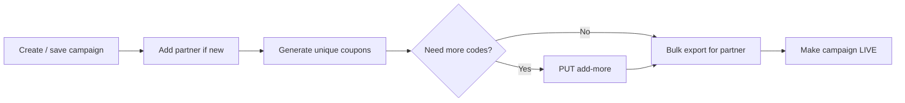

# CDMS — coupon & campaign operations (`cdms-core`)

| Field | Value |
|--------|--------|
| **Audience** | Ops, partner integrations, engineering |
| **Repo / modules** | [`coupon-discount-management-system`](../coupon-discount-management-system) — **`cdms-core`** (REST API), **`cdms-coupon-generator`** (async coupon generation via RabbitMQ), **`cdms-model`**, **`cdms-reporter`** |

## What this service does (short summary)

**CDMS (Coupon Discount Management System)** lets Tata Play define **B2B / partner campaigns** (budget, discount rules, eligible partners, unique vs promo coupons), **persist** them in MySQL, **generate large batches of unique coupon codes** (typically via **RabbitMQ** consumed by **`cdms-coupon-generator`**), **export** coupons for partners (CSV / bulk APIs), and **move campaigns to LIVE** when ready. The **`user`** request header identifies the operator for auditing.

---

## 1. Base URL & context path

Local / default from `cdms-core` dev config:

- **Context path:** **`/cdms-core`**
- **Port:** **`8080`** (override per env)

All API paths below are **relative to** `https://<host>/cdms-core` (e.g. UAT: `https://uat-cdms-core.internal.videoready.tv/cdms-core`).

---

## 2. Typical operational flow



1. **`POST /api/v1/campaign/save`** — draft campaign (gets `campaignCode` when returned / refreshed from UI).  
2. **`POST /api/v1/common/add-partners`** — register partner metadata (`PartnerDTO`) if not already present.  
3. **`POST /api/v1/campaign/{campaignCode}/coupon/generate-unique`** — enqueue unique series (prefix, length, count).  
4. **`PUT /api/v1/campaign/{campaignCode}/coupon/unique/add-more`** — same shape, smaller payload for extra volume.  
5. **`GET .../coupon/export/partner/bulk`** — download / return bulk export for a **series** + expiry + count cap.  
6. **`POST /api/v1/campaign/make-live`** — transition READY campaign to live state with full `CampaignRequestDTO`.

---

## 3. Headers (all calls)

| Header | Required | Notes |
|--------|----------|--------|
| **`user`** | **Yes** on coupon / export endpoints (see controllers) | Operator id (e.g. `cdms-user`). Use real SSO / service identity in each env — **do not** hardcode production users in scripts committed to git. |
| **`Content-Type: application/json`** | For JSON bodies | |
| **`apiVersion` / `appVersion` / `platform`** | Often sent by CDMS UI for campaign APIs | Match what the UI sends for UAT/prod if APIs validate them. |

Browser-only headers (`Sec-Fetch-*`, long `User-Agent`) can be omitted for `curl` unless a gateway requires them.

---

## 4. Campaign — create (draft)

**Controller:** `CampaignController` — `POST /api/v1/campaign/save`

```24:27:coupon-discount-management-system/cdms-core/src/main/java/tv/videoready/cdms/core/controller/CampaignController.java
    @PostMapping("/save")
    public ResponseDTO<ApiResponseDTO> saveCampaign(@Valid @RequestBody CampaignRequestDTO requestDTO) throws Exception {
        return campaignService.saveCampaign(requestDTO);
    }
```

**Example (shape only — adjust dates, GL, budget, packs):**

```bash
curl --location 'http://localhost:8080/cdms-core/api/v1/campaign/save' \
  --header 'Content-Type: application/json' \
  --header 'apiVersion: v3' \
  --header 'appVersion: 1.0.0' \
  --header 'platform: WEB' \
  --data '{
    "campaignCode": null,
    "campaignName": "Rohit",
    "couponValidity": 10,
    "campaignType": "B2B",
    "startDate": "2026-05-01 00:00:00",
    "expiryDate": "2026-05-30 00:00:00",
    "distributionEndDate": "2026-05-21 00:00:00",
    "glCode": "123",
    "budgetAmount": 1000,
    "addBudgetAmount": null,
    "campaignCouponType": "UNIQUE",
    "eligiblePartners": "TestPartner",
    "campaignRedeemType": "SINGLE_REDEEM",
    "campaignSegmentation": null,
    "discountType": "FLAT",
    "discountOffer": [{
      "id": 0,
      "packId": "ALL",
      "packName": "Binge All Packs",
      "discountRate": "100",
      "addPack": false,
      "removePack": false,
      "isDeleted": false,
      "isDiscountError": false,
      "amount": 3999
    }],
    "offerMsgs": null
  }'
```

Use the **`campaignCode`** returned by the API/UI (example below: **`CW6REOI`**) in subsequent steps.

---

## 5. Partner — add

**Controller:** `CommonApiController` — `POST /api/v1/common/add-partners`

```52:55:coupon-discount-management-system/cdms-core/src/main/java/tv/videoready/cdms/core/controller/CommonApiController.java
    @PostMapping("/add-partners")
    public ResponseDTO<ApiResponseDTO> addPartners(@RequestBody PartnerDTO partnerDTO) throws CommonApiException {
        return commonService.addPartners(partnerDTO);
    }
```

**Full path (with context path):**

```bash
curl --location 'http://localhost:8080/cdms-core/api/v1/common/add-partners' \
  --header 'Content-Type: application/json' \
  --header 'apiVersion: v3' \
  --header 'appVersion: 1.0.0' \
  --header 'platform: WEB' \
  --data '{
    "partnerName": "Zomato",
    "partnerRole": "PUH"
  }'
```

`PartnerDTO` also supports **`partnerCode`** when you need an explicit code — align with DB / UI conventions.

---

## 6. Unique coupons — generate (first batch)

**Controller:** `CouponController` — `POST /api/v1/campaign/{campaignCode}/coupon/generate-unique`

```36:41:coupon-discount-management-system/cdms-core/src/main/java/tv/videoready/cdms/core/controller/CouponController.java
    @PostMapping("{campaignCode}/coupon/generate-unique")
    public ResponseDTO generateUniqueCoupons(@RequestHeader("user") String user,
                                             @PathVariable("campaignCode") String campaignCode,
                                             @RequestBody List<UniqueCouponSeriesRequestDTO> couponSeriesDTO) throws Exception {
        couponService.generateUniqueCoupon(campaignCode, couponSeriesDTO);
```

**DTO fields (server model):** `couponPrefix`, `couponLength`, `requestedCouponCount` (**int**), `maxCouponGenerationCount` (**BigInteger**).

```18:22:coupon-discount-management-system/cdms-model/src/main/java/tv/videoready/cdms/model/dto/request/UniqueCouponSeriesRequestDTO.java
    private String couponPrefix;
    private int couponLength;
    private int requestedCouponCount;
    private BigInteger maxCouponGenerationCount;
```

**Example (minimal series row; UI may send extra UI-only fields):**

```bash
curl --location 'http://localhost:8080/cdms-core/api/v1/campaign/CW6REOI/coupon/generate-unique' \
  --header 'Content-Type: application/json' \
  --header 'user: <CDMS_OPERATOR_USER>' \
  --data '[{
    "couponPrefix": "RTT",
    "couponLength": 8,
    "requestedCouponCount": 20000,
    "maxCouponGenerationCount": 916132832
  }]'
```

Heavy generation is handled asynchronously via **`cdms-coupon-generator`** listening on **`${cdms.rabbitmq.queue}`** (see `application-dev.properties`: e.g. `cdms-coupon-uat`, exchange `cdms-topic`).

---

## 7. Unique coupons — add more

**Controller:** `CouponController` — `PUT /api/v1/campaign/{campaignCode}/coupon/unique/add-more`

```45:50:coupon-discount-management-system/cdms-core/src/main/java/tv/videoready/cdms/core/controller/CouponController.java
    @PutMapping("{campaignCode}/coupon/unique/add-more")
    public ResponseDTO addMoreUniqueCoupon(@RequestHeader("user") String user,
                                           @PathVariable("campaignCode") String campaignCode,
                                           @RequestBody List<UniqueCouponSeriesRequestDTO> couponSeriesDTO) {
        couponService.addMoreUniqueCoupon(campaignCode, couponSeriesDTO);
```

**Example:**

```bash
curl --location --request PUT 'http://localhost:8080/cdms-core/api/v1/campaign/CW6REOI/coupon/unique/add-more' \
  --header 'Content-Type: application/json' \
  --header 'user: <CDMS_OPERATOR_USER>' \
  --data '[{
    "couponPrefix": "RTT",
    "couponLength": 8,
    "requestedCouponCount": 20000,
    "maxCouponGenerationCount": 916132832
  }]'
```

(If the service rejects string numbers in JSON, send **numeric** types as in the DTO.)

---

## 8. Export — partner bulk

**Controller:** `CouponDistributionController`

```51:66:coupon-discount-management-system/cdms-core/src/main/java/tv/videoready/cdms/core/controller/CouponDistributionController.java
    @GetMapping("{campaignCode}/coupon/export/partner/bulk")
    public ResponseDTO exportBulkCoupon(@RequestHeader("user") String user,
                                        @PathVariable("campaignCode") String campaignCode,
                                        @RequestParam("seriesCode") String couponSeriesCode,
                                        @RequestParam(value = "couponExpiryDate") String couponExpiryDate,
                                        @RequestParam(value = "numberOfExportCoupons") int numberOfExportCoupons,
                                        HttpServletResponse response) {
```

**Example (UAT host):**

```bash
curl --location 'https://uat-cdms-core.internal.videoready.tv/cdms-core/api/v1/campaign/CW6REOI/coupon/export/partner/bulk?seriesCode=RTT&couponExpiryDate=2026-05-30%2000%3A00%3A00&numberOfExportCoupons=20000' \
  --header 'user: <CDMS_OPERATOR_USER>'
```

Respects export limits such as **`max.allowed.coupon.export.limit`** in `application-dev.properties` (e.g. `100000`).

---

## 9. Campaign — make LIVE

**Controller:** `CampaignController` — `POST /api/v1/campaign/make-live`

```40:42:coupon-discount-management-system/cdms-core/src/main/java/tv/videoready/cdms/core/controller/CampaignController.java
    @PostMapping("/make-live")
    public ResponseDTO<ApiResponseDTO> updateCampaignStatusToLive(@Valid @RequestBody CampaignRequestDTO requestDTO) throws CommonApiException {
        return campaignService.updateCampaignStatusToLive(requestDTO);
```

**Example body (trim to your real campaign; must include `campaignCode` and consistent state):**

```bash
curl --location 'http://localhost:8080/cdms-core/api/v1/campaign/make-live' \
  --header 'Content-Type: application/json' \
  --header 'apiVersion: v3' \
  --header 'appVersion: 1.0.0' \
  --header 'platform: WEB' \
  --data '{
    "campaignCode": "CW6REOI",
    "campaignName": "Rohit",
    "campaignType": "B2B",
    "campaignState": "READY",
    "startDate": "2026-05-01 00:00:00",
    "expiryDate": "2026-05-30 23:59:59",
    "distributionEndDate": "2026-05-21 23:59:59",
    "couponValidity": 10,
    "glCode": "123",
    "campaignBudget": { "id": null, "budgetAmount": 1000, "addBudgetAmount": null },
    "budgetAmount": 1000,
    "couponSeries": null,
    "uniqueCoupons": null,
    "promoCoupon": null,
    "discountType": "FLAT",
    "discountOffer": [{ "packId": "ALL", "discountRate": "100", "isDeleted": false }],
    "campaignRedeemType": "SINGLE_REDEEM",
    "campaignCouponType": "UNIQUE",
    "coolingPeriod": 0,
    "eligiblePartners": "Zomato",
    "campaignSegmentation": null,
    "offerMsgs": null,
    "couponResponseDTO": null,
    "redeemTrackerDTO": null
  }'
```

---

## 10. Related endpoints (reference)

| API | Method | Purpose |
|-----|--------|---------|
| `/api/v1/campaign/{code}/coupon/generate-promo` | POST | Promo coupon path (`CouponController`). |
| `/api/v1/campaign/{code}/series` | GET | List coupon series for campaign. |
| `/api/v1/campaign/max-coupon-count` | GET | Max combinations vs `couponLength`. |
| `/api/v1/campaign/{code}/coupon/export/partner` | GET | Single / targeted partner export (`partnerCode`, optional `rmn`, `seriesCode`, `validDays`). |
| `/api/v1/campaign/{code}/coupon/import/partner/{partnerCode}` | POST | CSV import (`MultipartFile`). |
| `/api/v1/campaign/coupon/issue` | POST | Issue coupon to RMN via external flow (`requestId` header + body). |
| `/api/v1/campaign/action/{status}` | POST | Status transitions other than make-live. |

---

## 11. Async generation (`cdms-coupon-generator`)

```24:27:coupon-discount-management-system/cdms-coupon-generator/src/main/java/tv/videoready/cdms/token/generator/rabbitmq/CdmsQueueListener.java
    @RabbitListener(queues = "${cdms.rabbitmq.queue}", concurrency = CONSUMER_CONCURRENCY)
    public void receiveCouponGenerationRequest(String jsonString) {
        log.info(" ====== Message received from queue ====== {}", jsonString);
        couponGenerationService.processCouponGenerationRequest(jsonString);
```

Tune **`spring.rabbitmq.*`** and **`cdms.rabbitmq.queue`** per environment so **core** publish and **generator** consume the same broker objects.

---

## 12. Browse in HTML

Run [`engineering-docs-hub`](../engineering-docs-hub) (`./gradlew bootRun` with JDK **8** for this repo’s Gradle wrapper), then open **http://localhost:8095/flows/cdms-campaign-coupon**.
