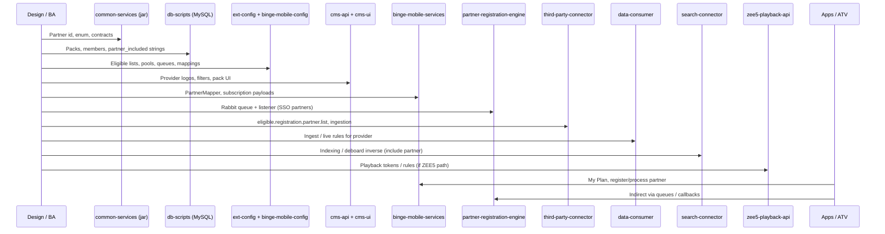

# Partner onboarding — MR flow & system map

| Field | Value |
|--------|--------|
| **Audience** | Engineering, QA, Release |
| **Companion doc** | [Partner deboarding (technical)](./PARTNER_DEBOARDING_TECHNICAL.md) — same layers, opposite operations |
| **Traceability** | Align each merged MR on GitLab with this checklist before sign-off. This file was written from **local repo behaviour** + your MR list; reconcile property names and SQL with the actual diffs. |
| **Browse as HTML** | Run [`engineering-docs-hub`](../engineering-docs-hub) (`./gradlew bootRun`), then open [http://localhost:8095/flows/onboarding](http://localhost:8095/flows/onboarding). |

---

## 1. What “partner onboarding” means here

**Onboarding** makes a new OTT / live partner visible and operable across Tata Play Binge: **identity & enums**, **commercial data (packs / Comviva)**, **runtime config**, **CMS tooling**, **mobile APIs**, **async registration**, **content & search**, and **playback** where applicable.

**Start:** contract + technical design (partner id, `Provider` / `Partner` enum, queues, pack rules).  
**End:** subscriber can see the partner in-plan / complimentary flows, content is discoverable, SSO or silent registration works (if in scope), and ops can manage the partner in CMS without manual hacks.

---

## 2. MR index (your links)

### V2 (shared library path)

| Repo | MR |
|------|-----|
| **jar/common-services** | [!162](https://gitlab.intelligrape.net/videoready-tatasky/jar/common-services/-/merge_requests/162) |

*Typical intent:* shared enums, DTOs, or constants consumed by multiple services — **merge or release this first** if downstream services depend on the new artifact version.

### V1 (full stack)

| Repo | MR |
|------|-----|
| **common-services** | [!4475](https://gitlab.intelligrape.net/videoready-tatasky/common-services/-/merge_requests/4475) |
| **db-scripts** | [!7373](https://gitlab.intelligrape.net/videoready-tatasky/db-scripts/-/merge_requests/7373) |
| **ext-config** | [!17629](https://gitlab.intelligrape.net/videoready-tatasky/ext-config/-/merge_requests/17629) |
| **binge-mobile-config** | [!1285](https://gitlab.intelligrape.net/videoready-tatasky/binge-mobile-config/-/merge_requests/1285) |
| **cms-api** | [!8598](https://gitlab.intelligrape.net/videoready-tatasky/cms-api/-/merge_requests/8598) |
| **cms-ui** | [!15787](https://gitlab.intelligrape.net/videoready-tatasky/cms-ui/-/merge_requests/15787) |
| **binge-mobile-services** | [!14002](https://gitlab.intelligrape.net/videoready-tatasky/binge-mobile-services/-/merge_requests/14002) |
| **partner-registration-engine** | [!1943](https://gitlab.intelligrape.net/videoready-tatasky/partner-registration-engine/-/merge_requests/1943) |
| **third-party-connector** | [!2986](https://gitlab.intelligrape.net/videoready-tatasky/third-party-connector/-/merge_requests/2986) |
| **data-consumer** | [!1344](https://gitlab.intelligrape.net/videoready-tatasky/data-consumer/-/merge_requests/1344) |
| **search-connector** | [!2316](https://gitlab.intelligrape.net/videoready-tatasky/search-connector/-/merge_requests/2316) |
| **zee5-playback-api** | [!633](https://gitlab.intelligrape.net/videoready-tatasky/zee5-playback-api/-/merge_requests/633) |

**Suggested merge order (dependency-aware):**  
`common-services` (or **jar/common-services** V2) → **db-scripts** (data) → **ext-config** + **binge-mobile-config** → **cms-api** / **cms-ui** → **binge-mobile-services** → **partner-registration-engine** → **third-party-connector** → **data-consumer** → **search-connector** → **zee5-playback-api** (only if the partner uses that stack).

Adjust if your MR explicitly bumps parent POMs or shared libraries first.

---

## 3. End-to-end flow (logical sequence)

---

## 4. Layer cheat-sheet (what each repo does for onboarding)

| Layer | Repositories | Onboarding action (inverse of deboarding) |
|--------|----------------|-------------------------------------------|
| **Shared types** | `common-services`, **jar/common-services** (V2) | Add `Partner` / `Provider` (or equivalent) so all services compile and route consistently. |
| **Authoritative data** | `db-scripts` | Insert/update `comviva_product`, `pack_details`, `pack_partner`, `comviva_members*`, `partners_included` tokens, partner logos — **match partner_id** used in config. |
| **Runtime toggles** | `ext-config`, `binge-mobile-config` | **Add** partner to eligible / platform / VIP / pool / flexi / `partner.platform.mappings`, `partner-mapping` JSON (ATV), bitrate maps, **remove** from `block.registration.partner.list` / `donot.send.partner.registration` where you want registration events. |
| **Operator surfaces** | `cms-api`, `cms-ui` | Provider in automation defaults, editorial mappings, `providerLogo.js`, filter allow-lists (`PartnersController` / pack management patterns). |
| **Subscriber APIs** | `binge-mobile-services` | `PartnerMapper`, subscription / complimentary lists, **`/api/v1/register/partner`**, **`/api/v1/process/partner`**, recon schedulers (`ProcessPartnerController`). |
| **Async SSO / silent reg** | `partner-registration-engine` | Rabbit exchange binding + `{partner}-REGISTRATION_QUEUE` listener (`AmqpConfig`); exclude only if partner is deboarded. |
| **Third-party ingest** | `third-party-connector` | `eligible.registration.partner.list`, push subscription validators, queues to ingestion (`SchedulingComponent` pattern). |
| **Catalogue pipeline** | `data-consumer` | Provider-specific ingest / live handling (mirror deboarding “purge” with **include** rules). |
| **Search / browse** | `search-connector` | Index provider content; ensure partner not on `search.deboard.partners.list` (deboarding doc lists the inverse). |
| **Playback** | `zee5-playback-api` | Only for partners on the ZEE5 playback path — entitlements, tokens, or provider switches per MR. |

---

## 5. Where to start / where to end (checklist)

### Start (before any MR)

1. **Partner id** and **string tokens** (`partners_included`, app enums) agreed with Comviva / product.  
2. **SSO vs silent vs freemium** path decided → drives **partner-registration-engine** vs **RegisterPartner** APIs only.  
3. **Content source** (TPC ingest, partner feed, ZEE5) → drives **third-party-connector**, **data-consumer**, **search-connector**, **zee5-playback-api** scope.

### Implementation end-state (Definition of Done)

| # | Verify |
|---|--------|
| 1 | **DB:** Pack and subscription rows exist; spot-check a test subscriber on staging. |
| 2 | **Config:** Partner appears on **eligible** lists; absent from **block** / **donot.send** where registration should run. |
| 3 | **CMS:** Operator can select provider where required; logos render. |
| 4 | **binge-mobile-services:** `PartnerMapper` (and related enums) list partner; subscription / My Plan shows partner; register/process flows succeed for a test `transactionId` / `baId`. |
| 5 | **PRE:** Message to partner routing key is consumed; no listener skip for deboarded-only partners. |
| 6 | **TPC:** Subscription update / ingestion accepts provider; messages reach expected queues. |
| 7 | **data-consumer / search-connector:** New content visible in internal tools or search API on staging. |
| 8 | **zee5-playback-api:** Playback smoke test **if** MR applies to this partner. |
| 9 | **Apps:** End-to-end journey (subscribe → open partner → SSO if applicable) on one client + one ATV build if partner is on large screen. |

---

## 6. Code anchors (local workspace)

Use these when an MR description is thin; compare with your branch diff.

| Concern | Location |
|---------|-----------|
| Freemium register / process | `binge-mobile-services/.../RegisterPartnerController.java`, `ProcessPartnerController.java` |
| PRE queue per partner | `partner-registration-engine/.../AmqpConfig.java`, `QueueMessageConsumer.java` |
| TPC eligible partners | `third-party-connector/.../PushSubscriptionRequestValidator.java`, `SchedulingComponent.java` |
| Partner migration listener | `partner-registration-engine/.../OnBoardingListnerServiceImpl.java` (queue `partner-migration`) |
| CMS pack partners | `cms-api/.../PartnersController.java`, `PartnersServiceImpl.java` |
| Example SQL onboard patterns | `db-scripts/dml/atv/**onboard*.sql`, `db-scripts/mongo/partner-integration/` |

---

## 7. If something is missing from the MR set

| Symptom | Likely extra surface |
|---------|----------------------|
| SSO works on app but not DTH / ATV | `ext-config` **fs.*** / **atv.*** partner maps, `it-connector-comviva`, large-screen services |
| Comviva events not firing | `donot.send.partner.registration`, action-listener **block** lists, **it-connector** publish paths |
| Content in CMS but not in app | **content-detail** / **content-subscriber-detail** provider utils, cache **binge-cache-service** |
| Login / profile mismatch | **profile-mgmt**, **login-service**, `partner.name.mapping` blobs (see deboarding doc § partner mapping) |

Treat this table as **triage**, not an exhaustive architecture list.

---

## 8. V1 vs V2 note

- **V1 `common-services`** MR: changes inside the classic monorepo-style **common-services** project.  
- **V2 `jar/common-services`** MR: likely the same shared code published as a **versioned JAR** consumed by other builds.  
For onboarding, ensure **one** source of truth for enums: bump dependent services’ dependency version when V2 ships.
