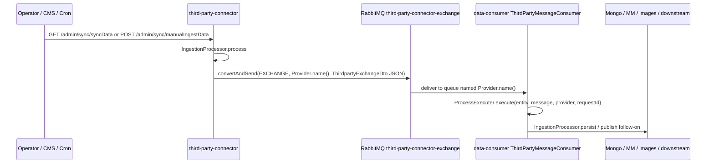

# Third-party connector → RabbitMQ → data-consumer (ingestion flow)

| Field | Value |
|--------|--------|
| **Audience** | Engineering, CMS ops, partner ingestion SRE |
| **Services** | **`third-party-connector`**, **`data-consumer`** |
| **MRs (GitLab)** | [third-party-connector !2958](https://gitlab.intelligrape.net/videoready-tatasky/third-party-connector/-/merge_requests/2958/diffs) · [data-consumer !1334](https://gitlab.intelligrape.net/videoready-tatasky/data-consumer/-/merge_requests/1334) |

This runbook traces **bulk sync** (`/admin/sync/syncData`) and **single-item manual ingest** (`/admin/sync/manualIngestData`) through to **RabbitMQ** and **`data-consumer`** listeners. Reconcile env-specific hosts and enums with the merged MR diffs.

---

## 1. HTTP entry points (`third-party-connector`)

Context path (typical): **`/third-party-connector`** — see `ext-config/third-party-connector/application-*.properties` (`server.servlet.context-path`).

Controller base class mapping:

```60:62:third-party-connector/src/main/java/tv/videoready/tp/controller/IngestionController.java
@RestController
@RequestMapping(value = "/admin/sync")
public class IngestionController {
```

| Operation | Method & path | Role |
|-----------|----------------|------|
| **Bulk / scheduled sync** | `GET /admin/sync/syncData` | Validates `IngestionRequest`, runs **`ProcessExecuter.execute`** → provider **`IngestionProcessor`** → partner API / DB → **`SchedulingComponent.stringifyAndPushIntoQueue`** → RabbitMQ. |
| **Manual single content** | `POST /admin/sync/manualIngestData` | Query: `entityType` (required), `isCreateNew` (optional). Body: **`IngestDto`**. Delegates to **`ManualIngestionExecuter`** → **`ManualIngestion`** (VOD / SERIES / BRAND) → same queue publish path as applicable. |
| **CMS-style manual tooling** | Under **`/admin/manual/ingestion`** | **`ManualIngestionTriggerController`** — supporting metadata, rails, triggers; not the same as `syncData` but same connector app. |

`ProcessExecuter` (sync pipeline):

```20:24:third-party-connector/src/main/java/tv/videoready/tp/executer/ProcessExecuter.java
    public String execute(IngestionRequest request) throws Exception{
        IngestionProcessor processor= ingestionProcessorFactory.getIngestionProcessor(request);
        IngestionProcessorDTO dto=processor.getIngestionProcessor(request);
        return processor.process(dto,request);
    }
```

---

## 2. Example: ETV Win full sync (GET)

**Pattern (UAT via TAPI):**

```http
GET https://<tapi-host>/third-party-connector/admin/sync/syncData?full=true&provider=ETVWIN&etvWinShowType=LIVE_TV&duplicateChecker=false&filterDuplicate=false
```

| Query param | Meaning |
|-------------|---------|
| `provider` | `Provider` enum (e.g. **`ETVWIN`**) — selects **`ETVWinIngestionProcessor`**. |
| `full` | Full vs incremental behaviour (processor-specific). |
| `etvWinShowType` | **`ETVWinShowType`** on `IngestionRequest` (e.g. **`LIVE_TV`**) — drives which catalogue slices are pulled. |
| `duplicateChecker` / `filterDuplicate` | Ingestion flags on `IngestionRequest` (see `IngestionRequest` fields). |

**ETV Win processor** builds per-entity **`IngestionProcessorDTO`** rows (VOD, SERIES, BRAND, LIVE_CHANNEL, EPG, etc.) via **`ingestionProcessorFactory.getExchange(ETVWIN, EntityType.*)`** and pushes **`ThirdpartyExchangeDto`** JSON to Rabbit — see `ETVWinIngestionProcessor` (`processContent`, purge paths, `schedulingComponent.stringifyAndPushIntoQueue`).

---

## 3. Example: Manorama MAX–style manual ingest (POST)

Partners differ by **`provider`** and **`entityType`**; the **URL shape is the same**. Swap **`ETVWIN`** for **`MANORAMAMAX`** (or the correct `Provider` literal) in **`IngestDto`** and use the right **`ShowType`** / metadata for that partner.

**Endpoint:**

```http
POST https://<tapi-host>/third-party-connector/admin/sync/manualIngestData?entityType=VOD&isCreateNew=false
Content-Type: application/json
```

**Body (`IngestDto`)** — minimal illustration only; real payloads must match CMS / connector validation:

```json
{
  "provider": "MANORAMAMAX",
  "contentId": "<partner-or-mm-content-id>",
  "showType": "MOVIE",
  "title": "Example title"
}
```

`ManualIngestionExecuter` routes by **`entityType`**:

```15:21:third-party-connector/src/main/java/tv/videoready/tp/executer/ManualIngestionExecuter.java
    public String doManualIngestion(EntityType entityType,boolean isCreateNew, IngestDto ingestDto,boolean cmsEnableDisableProvider) throws Exception{
        return switch (entityType) {
            case VOD -> manualIngestion.doManualVodIngestion(entityType,isCreateNew,ingestDto,cmsEnableDisableProvider);
            case SERIES -> manualIngestion.doManualSeriesIngestion(entityType,isCreateNew,ingestDto,cmsEnableDisableProvider);
            case BRAND -> manualIngestion.doManualBrandIngestion(entityType,isCreateNew,ingestDto,cmsEnableDisableProvider);
            default -> null;
        };
    }
```

CMS often builds these calls from config keys such as **`application.thirdPartyConnector.manualIngestion`** in `ext-config/cms-ui` (concatenate `entityType=`).

**Implementation note:** `ManualIngestionImpl` resolves or builds **`ConnectorVod` / `ConnectorSeries` / `ConnectorBrand`** and calls the same **`schedulingComponent.stringifyAndPushIntoQueue(...)`** used by bulk processors, so manual and sync paths converge on §4.

---

## 4. RabbitMQ publish (`third-party-connector`)

**Exchange** (constant):

```3:6:third-party-connector/src/main/java/tv/videoready/tp/util/constants/AppConstants.java
    String EXCHANGE="third-party-connector-exchange";
```

**Routing key & headers:** `IngestionProcessorDTO` sets **`exchange`** to that constant and **`route`** to **`provider.name()`** (e.g. `ETVWIN`, `MANORAMAMAX`). `SchedulingComponent.convertAndSend` publishes JSON and sets headers **`entityType`** (`AppConstants.ENTITY_TYPE_KEY`) and **`requestId`**.

```69:74:third-party-connector/src/main/java/tv/videoready/tp/component/SchedulingComponent.java
    private Boolean convertAndSend(IngestionProcessorDTO dto) {
        amqpTemplate.convertAndSend(dto.getExchange(), dto.getRoute(), dto.getMessage(), m -> {
            m.getMessageProperties().getHeaders().put(AppConstants.ENTITY_TYPE_KEY, dto.getEntityType());
            m.getMessageProperties().getHeaders().put("requestId",dto.getUniqueId());
            return m;
        });
```

Payload type: **`ThirdpartyExchangeDto<…>`** (VOD/Series/Brand/LiveChannel, etc.) serialized as JSON.

---

## 5. RabbitMQ consume (`data-consumer`)

**Exchange** matches publisher:

```41:42:data-consumer/src/main/java/tv/videoready/dataconsumer/constants/DataConsumerConstant.java
    String EXCHANGE="third-party-connector-exchange";
```

**Per-provider queues:** For each non-deboarded **`Provider`** enum value, **`AmqpConfiguration`** declares a **quorum queue** named exactly **`Provider.name()`** and binds it to **`third-party-connector-exchange`** with routing key **`Provider.name()`**.

```61:71:data-consumer/src/main/java/tv/videoready/dataconsumer/config/listener/AmqpConfiguration.java
        for (Provider provider: Provider.values()) {
            String providerName = provider.name();
            ...
            rabbitAdmin().declareQueue(new Queue(provider.name(),true, false, false, quorumArgs));
            rabbitAdmin().declareBinding(new Binding("", Binding.DestinationType.QUEUE,exchange.getName(),provider.name(),null));
            rabbitmqListeners.put(provider, makeListener(provider));
        }
```

**Consumer:** **`ThirdPartyMessageConsumer`** reads headers **`entityType`** and **`requestId`**, then **`ProcessExecuter.execute`** → **`IngestionProcessorFactory`** → entity-specific processors (persist MM / Mongo, images, downstream publishers such as search, etc.).

```34:44:data-consumer/src/main/java/tv/videoready/dataconsumer/config/listener/ThirdPartyMessageConsumer.java
    public void onMessage(Message message, Channel channel) throws Exception {
        try {
            String entityName = (String) message.getMessageProperties().getHeaders().get(DataConsumerConstant.ENTITY_TYPE_KEY);
            String requestId = (String) message.getMessageProperties().getHeaders().get("requestId");
            ...
            ((ProcessExecuter) SpringContext.getBean(ProcessExecuter.class)).execute(entity, message, provider, requestId);
```

**Deboarded providers:** Queues/listeners are **skipped** when the provider appears in **`deboarded.providers`** (same pattern as partner-registration-engine).

---

## 6. `ext-config` — names to grep per environment

Values differ by **UAT / prod** and region file; always read the active **`data-consumer`** and **`third-party-connector`** property bundles.

| Property file | Keys (examples from UAT snippets) | Role |
|----------------|-------------------------------------|------|
| **`ext-config/data-consumer/application-uat.properties`** | `worker.rabbitmq.exchange` (**`worker-exchange`**), `worker.rabbitmq.queue` (**`thirdparty-worker`**), `worker.rabbitmq.mm.routing.key` (**`MM.#`**), `anywhere.third.party.queue` (**`third-party-anywhere`**), `root.rabbitmq.exchange` (**`third-party-connector-exchange`**) | Worker / anywhere / live-event related wiring **in addition to** the main per-provider listeners. |
| **`ext-config/third-party-connector/application-uat.properties`** | `spring.rabbitmq.*`, `config.rabbitmq.virtualhost` | Connector → broker connection for **publish**. |

**`data-consumer` `IngestionRabbitConfig`** (conditional on `search.rabbitmq.port`) binds **`thirdparty-worker`** to **`worker-exchange`** for **post-processing / search publish** paths — **not** the same bean as **`AmqpConfiguration`** inbound third-party queues, but part of the **overall** ingestion → search story after MM writes.

---

## 7. End-to-end sequence



---

## 8. After data-consumer (search / Binge media search)

Successful VOD/Series/Brand processing often triggers **`IngestionDataPublisher.publish`** (and related **`IngestionRabbitConfig`** paths) toward **search** queues — see `VODServiceImpl` / `SeriesServiceImpl` / `BrandServiceImpl` for `ingestionDataPublisher.publish`. That connects this flow to **[Binge media search ingestion](./BINGE_MEDIA_SEARCH_INGESTION.md)** (Kafka `content-updates` / Discovery Engine) **downstream**; exact routing depends on env flags (`search.rabbitmq.*`).

---

## 9. Quick checklist

- [ ] Confirm **`Provider`** enum spelling matches queue name (**`ETVWIN`**, **`MANORAMAMAX`**, …).
- [ ] Confirm **`deboarded.providers`** does not block the partner in **`data-consumer`**.
- [ ] For manual ingest, **`entityType`** is one of **VOD / SERIES / BRAND** supported by `ManualIngestionExecuter`.
- [ ] Watch **`data-consumer`** logs for **`ThirdPartyMessageConsumer`** and provider processor errors.
- [ ] If search index stale after MM update, follow **binge-media-search-ops** single-item or Kafka ingestion runbook.

---

## 10. Browse in HTML

Run [`engineering-docs-hub`](../engineering-docs-hub) and open **http://localhost:8095/flows/third-party-connector-ingestion**.
